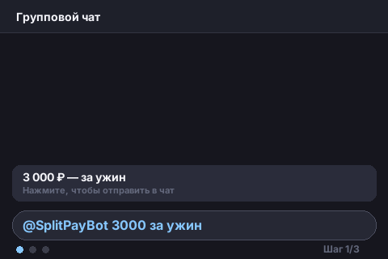

# SplitPay

> Inline Telegram-бот для разделения расходов между друзьями

<p align="center">
  
</p>

## Что это

Пишешь `@SplitPayBot 3000 за ужин` в любом чате — бот создаёт карточку с суммой и реквизитами. Участники нажимают «Я должен» — бот пересчитывает доли. После перевода отмечают «Я отдал» — карточка обновляется.

## Возможности

- **Inline-режим** — работает в любом чате без добавления бота
- **Автоматический split** — сумма делится поровну между участниками
- **Динамические доли** — каждый новый участник пересчитывает суммы
- **Карточка расхода** — PNG с суммой, реквизитами и списком должников
- **Статусы оплаты** — ○ должен / ✓ отдал, обновляются в реальном времени
- **Онбординг** — /start → ввод телефона → выбор банка → готов

## Как использовать

```
1. Напишите /start боту @SplitPayBot в личные сообщения
2. Пройдите онбординг: укажите телефон и банк
3. В любом чате наберите: @SplitPayBot 3000 за ужин
4. Выберите результат — карточка появится в чате
5. Участники нажимают «Я должен 💰» — доли пересчитываются
6. После перевода нажимают «Я отдал ✓» — статус обновляется
```

## Быстрый старт

### Локально

```bash
git clone https://github.com/sanyasamineva0x/SplitPay.git
cd SplitPay
cp .env.example .env  # заполнить BOT_TOKEN
pip install -e .
python -m bot
```

### Docker Compose

```bash
git clone https://github.com/sanyasamineva0x/SplitPay.git
cd SplitPay
cp .env.example .env  # заполнить BOT_TOKEN
docker-compose up -d
```

### Railway

[](https://railway.com/template?referralCode=splitpay)

Добавьте переменную окружения `BOT_TOKEN` в настройках Railway.

### Настройка канала для карточек (рекомендуется)

Для стабильной работы inline-карточек создайте служебный канал:

1. Создайте приватный канал в Telegram
2. Добавьте бота как администратора
3. Перешлите любое сообщение из канала боту [@userinfobot](https://t.me/userinfobot)
4. Скопируйте ID (начинается с `-100`)
5. Добавьте в `.env`: `UPLOAD_CHAT_ID=-100...`

Без канала карточки загружаются через ЛС создателя расхода — работает, но создатель получает уведомления.

## Стек

Python 3.12 · aiogram 3 · SQLAlchemy 2.0 · Pillow · aiosqlite · pydantic-settings

## Архитектура

```
bot/routers/     →  bot/services/     →  bot/db/repositories.py  →  SQLite
  private.py           card_renderer.py      UserRepo
  inline.py            expense_service.py    ExpenseRepo
  callbacks.py
```

Layered monolith: чистые слои, один Docker-контейнер. Роутеры не обращаются к БД напрямую — вся логика в сервисах.

## Разработка

```bash
pip install -e ".[dev]"     # установка с dev-зависимостями
pytest tests/ -v            # тесты
ruff check bot/ tests/      # линт
ruff format bot/ tests/     # форматирование
docker-compose up -d        # запуск через Docker
python -m bot               # запуск (нужен .env с BOT_TOKEN)
```

## Собран с помощью AI

Проект спроектирован, реализован и отревьюирован мультиагентным пайплайном Claude Code.
Весь процесс — в [docs/plans/](docs/plans/).

## Лицензия

MIT
